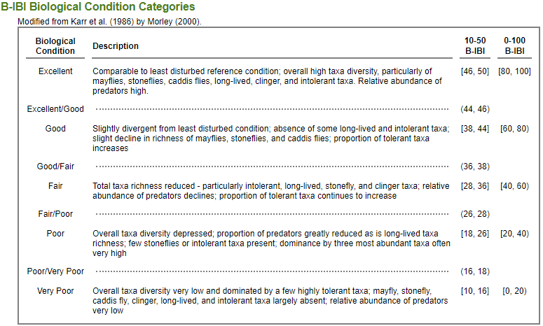

# Benthic data

Benthic macroinvertebrates are monitored and used as an indicator of the biological health of streams and nearshore Salmon habitats. This dataset created by the Puget Sound Stream Benthos Partnership specifcally uses the Puget Sound Lowlands [Benthic Index of Biotic Integrity](https://pugetsoundstreambenthos.org/About-BIBI.aspx) (B-IBI). This is a composite index of 10 metrics. Each individual metric is given a score of 1 through 5, with higher numbers given to conditions representative of streams unaltered by anthropogenic influence.

This chart breaks down the final B-IBI score.

