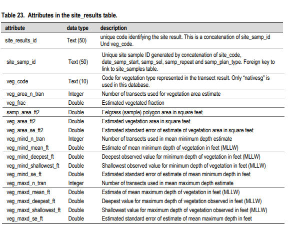

# Seagrass data

Seagrass is monitored anually by the Washington State Department of Natural Resources (DNR). Seagrass is a key indicator of ecosystem health as it serves as food source, nursery and shelter for many different species, including juvenile salmon. For more information I recommend reading [Eelgrass as Valuable Nearshore Foraging Habitat for Juvenile Pacific Salmon in the Early Marine Period](https://dspace.library.uvic.ca/handle/1828/7683) by Laura Kennedy, University of Victoria. This data is a small subset of what is published by WA-DNR, the whole dataset is avaliable [here](https://data-wadnr.opendata.arcgis.com/search?groupIds=6156be63723248acb386917641ff397f&q=puget%20sound%20seagrass%20monitoring%20complete%20download). This dataset includes the location of the sample, the time the sample was started, and information about seagrass levels at the sample. This is constructed from several different tables in the original dataset (site_info, site_samples, site_results).\
\
This chart explains the seagrass data obtained from the 'results' table
\

